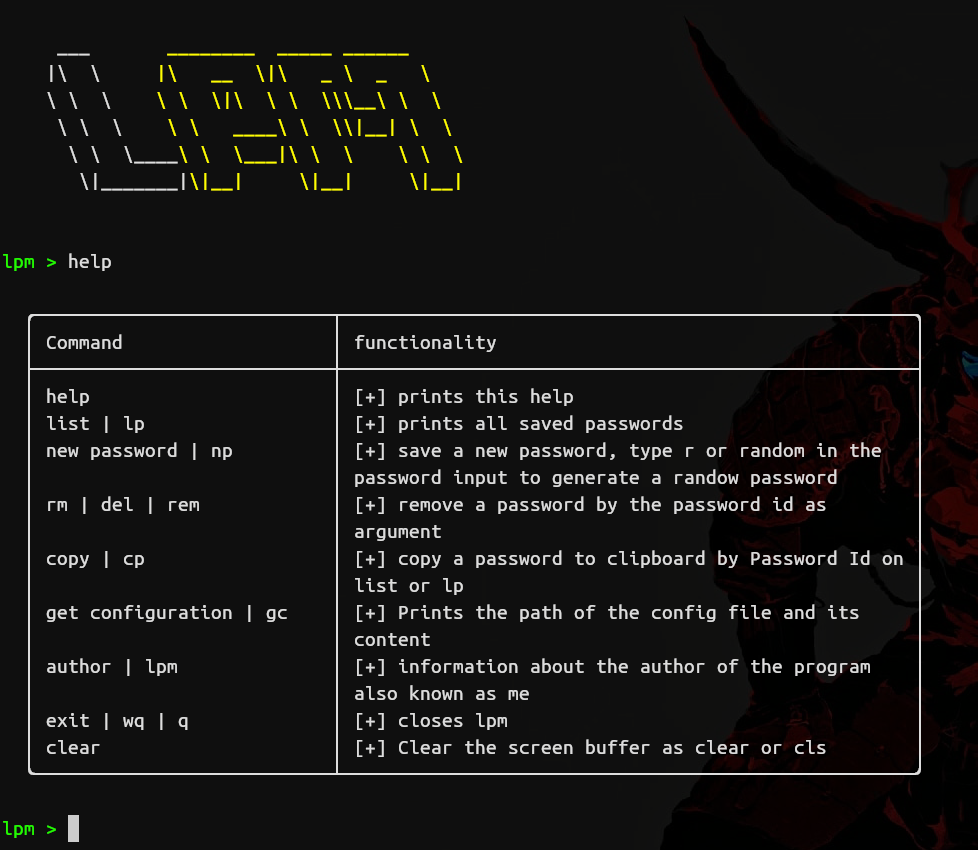

# Welcome to Letder's Password Manager !

LPM is a highly secure password management application that allows you to store all your passwords securely and protected in an easy and simple way. With LPM, you can have peace of mind knowing that your passwords are protected, and you don't have to worry about remembering multiple complicated passwords.

**Key Features:**

- Securely encrypted password storage.
- Memory safety and protected again forensics techniques.
- Password generator that enables you to create secure and unique passwords.
- Quick and easy access to your passwords with just one master password.
- Cross-platform.

## Lpm remote feature realeased !! 
use lpm remote in 3 steps
 1. start lpm in the server with lpm --server.
 2. In the lpm\_conf.toml, change lpm\_remote\_server to true and set the server ip address in lpm\_remote\_server\_ipaddr.
 3. Now run lpm on the client it will try connect to the server.

## Why should I use Lpm?
LPM not only helps you efficiently manage your passwords but also provides you with peace of mind regarding the security of your data. Your passwords are encrypted and protected by a master password that only you know.

Furthermore LPM interface is based on terminal TUI that is better on rendiment and charges does not need many resources.

So, don't wait any longer and download LPM today to protect your passwords and feel secure online!

## Preview and commands

